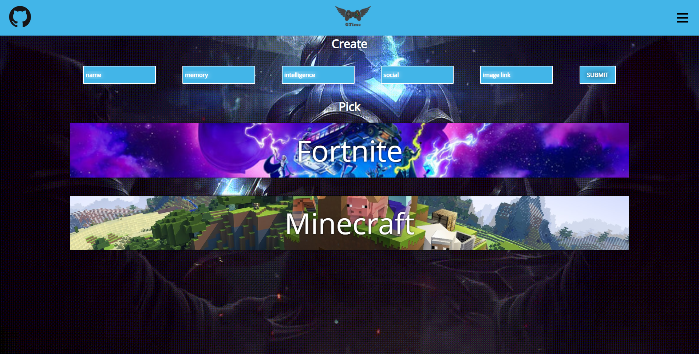

# GTime Front-End

> This is a website for Creating measurements of a game

## Built With

- HTML
- CSS
- JavaScript
- React
- redux
- Jest
- [GTime Back-End API](https://github.com/Spayco/GTime-Backend)

## Live Demo

[Live Demo Link](https://gtime.netlify.app/)

## Getting Started

- `npm install`
- `npm start`

## Making Changes

- if you wanna make changes do them on the src folder 
- if you want to preview changes live use *npm start* from your terminal
- when you finish your changes, run *npm run build* to create the production files to the dist folder

## Testing

to run the test, simply run `npm test`

## Authors

👤 **SpaYco**

- Github: [@SpaYco](https://github.com/SpaYco)
- Twitter: [@iSpaYco](https://twitter.com/iSpaYco)
- Linkedin: [Aziz Mejri](https://linkedin.com/in/spayco)

## 🤝 Contributing

Contributions, issues and feature requests are welcome!

Feel free to check the [issues page](issues/).

## Show your support

Give a ⭐️ if you like this project!

## 📝 License

This project is [MIT](lic.url) licensed.
